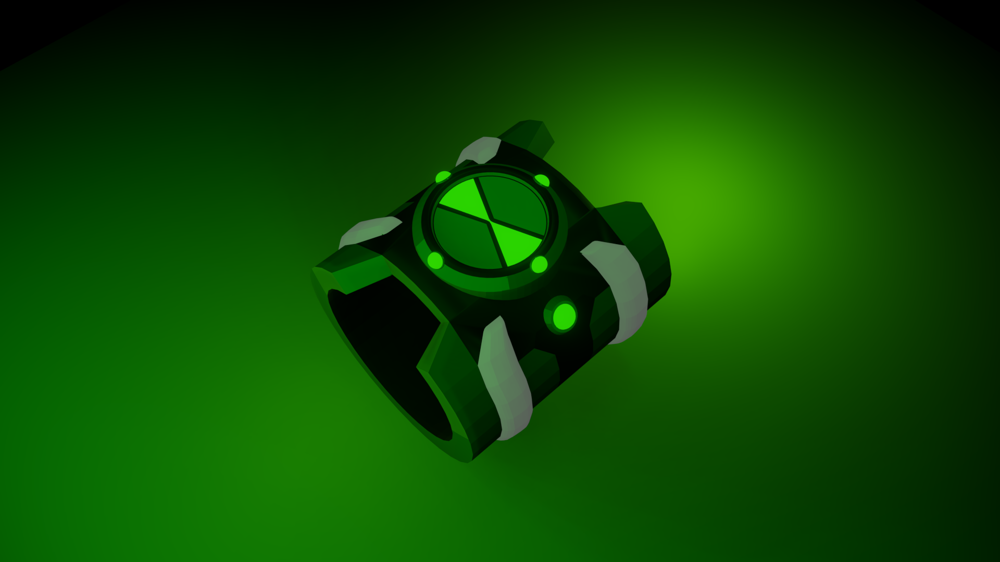
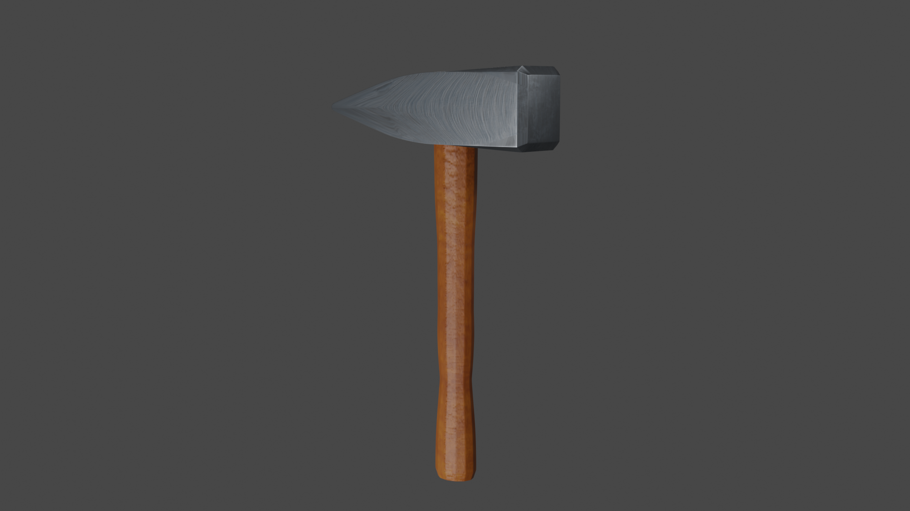
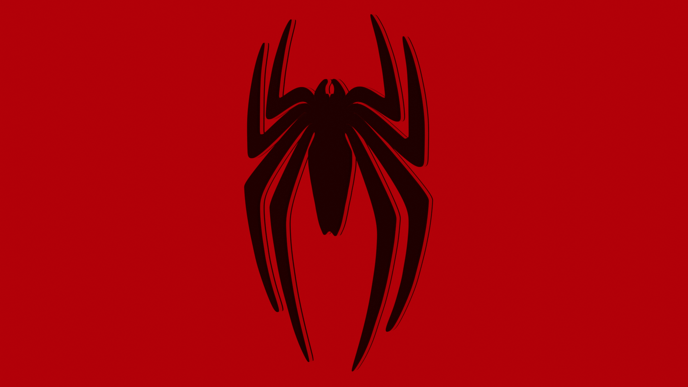
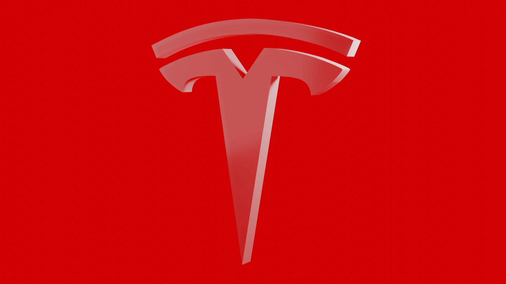
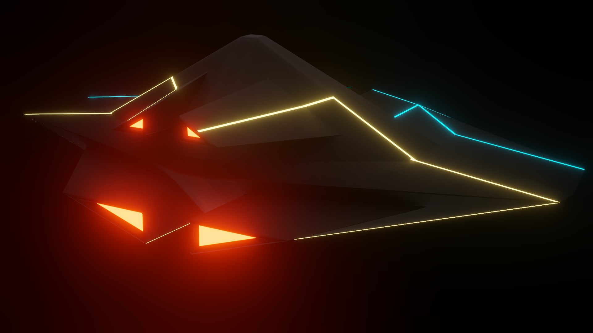
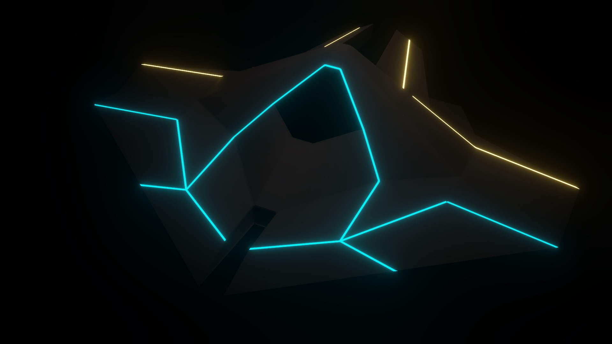
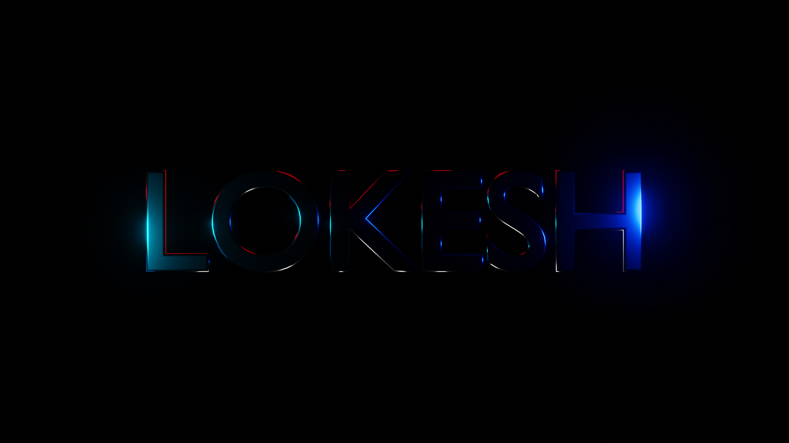

# 3D Animation & Modeling Projects

## About the Projects
My love for modeling and animation, combined with my hobby of exploring new technologies, resulted in the development of multiple 3D models stored in this repository. These projects were created using **Blender** and integrated into **Unity** for visualization and interactive experiences.

## Tools & Technologies
- **Modeling & Animation:** Blender  
- **Game Engine Integration:** Unity  
- **Texturing & Rendering:** Blender Cycles, Eevee  
- **File Formats:** `.blend`, `.blend1`, `.png`, `.jpg`, `.mp4`

## Projects Highlights

### **Object & Prop Modeling**
- Modeled a **Ben 10 Omnitrix watch**, focusing on accuracy in shape and detailing.  
- Created a **realistic hammer** with textured surfaces to enhance material appearance.
- ## Preview Screenshots
    
    

### **Logos & Branding**
- Designed 3D logos, including **Spider-Man** and **Tesla**, applying texturing and rendering techniques.  
- Experimented with depth, shading, and lighting to give logos a polished and professional look.
- ## Preview Screenshots
     
     

### **Sci-Fi & Concept Models**
- Developed a 3D **alien spaceship**, incorporating futuristic design elements.  
- Applied metallic textures and lighting effects to enhance realism and visual appeal.  
- ## Preview Screenshots
    
    
  
### **Word Animation**
- Created **animated 3D text sequences**, experimenting with different fonts, movements, and effects.  
- Applied keyframe animation techniques to create smooth transitions and motion effects.
- ## Preview Screenshots
     
